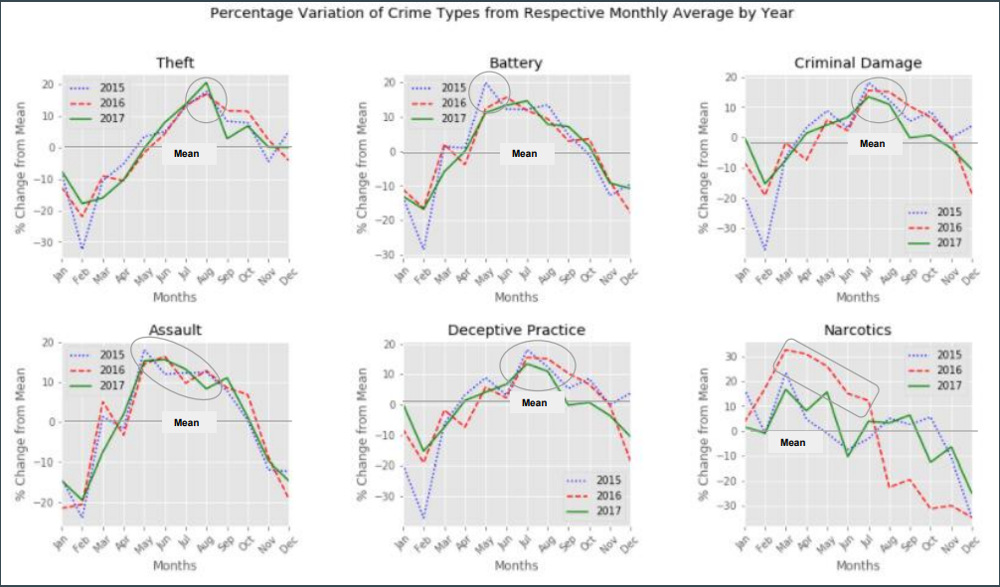

# Chicago Crime Analysis
Team Project towards Python for Data Science coursework

*Kwangwei Huang, Yue Hu, Angshuman Paul, Anu Sankar*

### Goal 

- Descriptive Analysis of a dataset, using the numpy and pandas tools covered in class.
- Formulate interesting questions and analyze the dataset to answer those.  
- Do not used statistical inference or other advance techniques.
- Final submission: Jupyter notebook with all the code and a report in pdf format ( max 8 pages long)

### Sample Analysis : 

#### *Year-over-Year Seasonal Variation of Crime*

We had a hypothesis that crimes and especially theft would increase during the holiday season (Novemeber, December) when families travel.

  
    
#### *Conclusion*

We found that various crimes peak during different months.  There is a strong correlation between the seasons (temperatures) and when the crimes peak. Contrary to our hypothesis,  we saw an overall decline in crime during the winter months.  So we concluded that theft does not increase substantially during the holidays.
 
